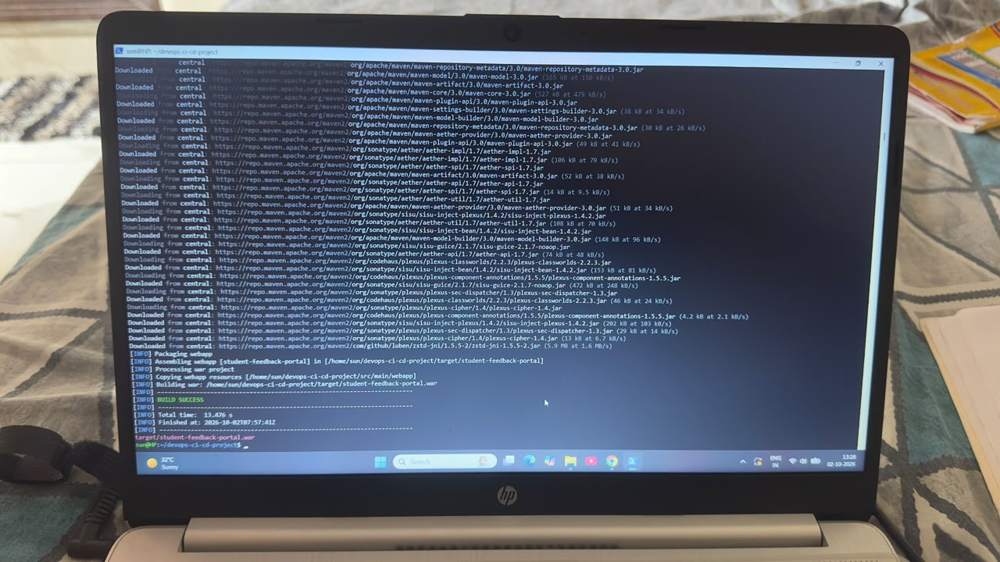

# Student Feedback Portal - Jenkins CI/CD Project

This is my DevOps internship project. It is a small Java web app (a student feedback portal)
that I deploy to Tomcat using a Jenkins pipeline. The main thing I wanted to show is what
happens when something goes wrong: a failing test should stop the pipeline, and a bad
deployment should roll back to the last working version by itself.

## Why I made this

Before this, building and deploying meant doing everything by hand: build the WAR, copy it
to Tomcat and check if it works. If a release was broken, the site stayed down until I fixed
it. With this pipeline all of that happens automatically on every push.

## What I used

- Java (Jakarta Servlets) and Maven
- Git and GitHub
- Jenkins (running on port 8080)
- Apache Tomcat (running on port 8081)
- Ubuntu on WSL

## Project layout

- `src/` - the application code (servlets, JSP pages) and the unit tests
- `Jenkinsfile` - the pipeline definition
- `pom.xml` - Maven build file
- `data/sample-feedback.csv` - sample feedback data
- `docs/` - extra notes: `architecture.md`, `setup-guide.md` and `rollback-runbook.md`

## How the pipeline works

1. **Build** - Maven compiles the code and packages the WAR file.
2. **Test** - runs the unit tests. If a test fails, the pipeline stops here and nothing is
   deployed.
3. **Backup Current Deployment** - copies the WAR that is currently running to
   `/opt/tomcat/backups/student-feedback-portal.war.bak`.
4. **Deploy** - puts the new WAR into Tomcat's webapps folder.
5. **Verify** - calls `/student-feedback-portal/health` with `curl -f`. Anything other than
   HTTP 200 fails the build.
6. **Rollback** - if the pipeline fails after the backup, the post step copies the `.bak`
   file back so the previous version is live again.

The health check is a small servlet (`HealthServlet.java`). It returns
`OK - feedback count: N` when the application has started properly.

## What I tested

### Case A - a failing test

I added a test that fails on purpose (build #2). The pipeline failed at the Test stage, the
remaining stages were skipped and nothing was deployed. After I reverted the commit,
build #3 went green.


### Case B - a bad deployment

This one passes the tests but breaks the app. I changed the health endpoint to return
HTTP 503 and pushed it (build #4). Jenkins deployed it, the Verify stage got the 503, and
then the pipeline restored the old WAR on its own. In the stage view below, build #4 fails
at Verify, and the last step still runs green: that is the rollback.


The terminal shows the commit that broke the endpoint, the revert, and the health check
returning 200 afterwards:


After the revert (build #5, green) the endpoint also answers in the browser:


## Build history

| Build | What I did | Result |
|-------|------------|--------|
| #1 | First working pipeline | Passed |
| #2 | Added a failing test | Failed at Test |
| #3 | Reverted the test | Passed |
| #4 | Made /health return 503 | Failed at Verify, rolled back |
| #5 | Reverted the health change | Passed |

## Setup screenshots

Maven build success:



First commit of the project:


## Running it

```
git clone https://github.com/radhakarthikeya/devops-ci-cd-project.git
cd devops-ci-cd-project
mvn clean package
```

For the pipeline, create a Jenkins pipeline job that points to this repo (it uses the
Jenkinsfile in the root) and click Build Now. Tomcat needs to be running on port 8081 first.
More detail is in `docs/setup-guide.md`.

## What I learned

- A green test run does not mean the deployment is healthy, so a separate health check after
  deploying is important.
- Taking a backup before every deploy makes automatic rollback simple.
- Keeping each failure as its own commit made it easy to show and easy to undo.

Radha Karthikeya
